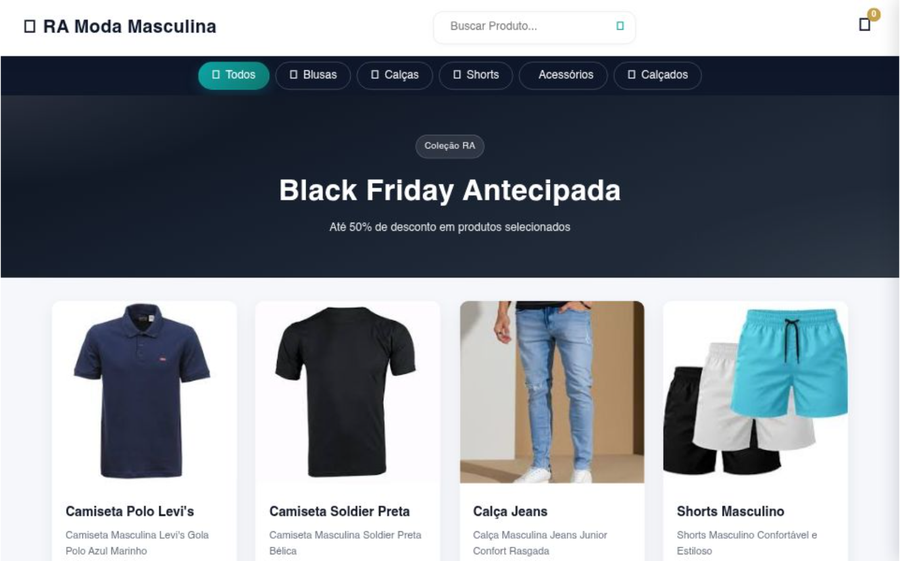

# 🕴️ RA Moda Masculina - E-commerce Landing Page

> Uma vitrine digital sofisticada e moderna desenvolvida para o segmento de moda masculina, focada em branding e experiência visual.

## 🔗 Demonstração
**Veja o projeto online:** [Acesse aqui](https://ra-moda-masculina.vercel.app/)

---

## 💻 Sobre o Projeto
O projeto **RA Moda Masculina** foi criado para explorar o uso de tipografia marcante e layouts de alta fidelidade visual. O objetivo foi desenvolver uma interface que não apenas apresentasse as roupas, mas que construísse uma narrativa de estilo para o usuário. Trabalhei com transições suaves e uma estrutura de grid que valoriza as fotografias dos produtos.

## 🛠️ Tecnologias Utilizadas
- **HTML5:** Estrutura semântica focada em acessibilidade.
- **CSS3:** Estilização avançada com foco em paleta de cores sóbrias e contrastantes.
- **Design Responsivo:** Adaptado para oferecer uma experiência de boutique no celular e no desktop.
- **Vercel:** Hosting e deploy automatizado.

## 🎨 Diferenciais Técnicos
- **Curadoria Visual:** Layout que prioriza a estética e o desejo de consumo do usuário.
- **Hierarquia de Informação:** Organização clara de coleções e categorias de produtos.
- **Navegação Intuitiva:** Foco em levar o usuário da descoberta do produto ao contato/compra.

## 📸 Preview

---
### 👨‍💻 Contato
**Matheus Rodrigues** [LinkedIn](https://www.linkedin.com/in/matheus-rodrigues-4398423b9) | [GitHub](https://github.com/mathrodriguesdev-arch)
