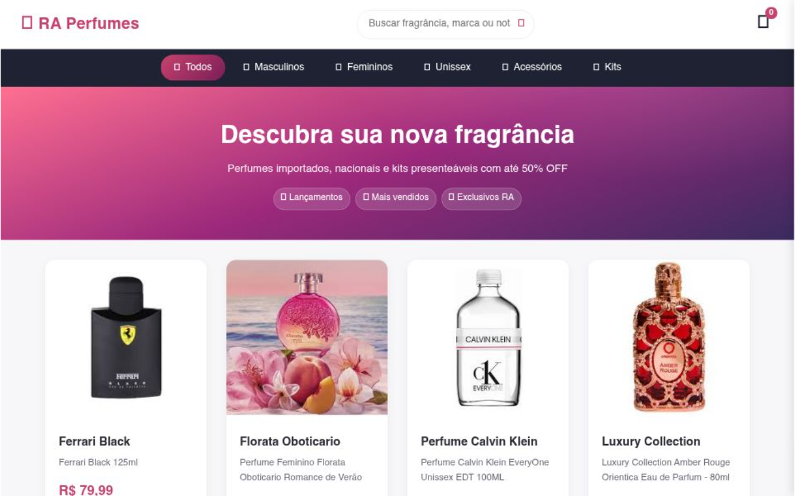

# 🧪 RA Perfumes - Boutique Digital de Fragrâncias

> Uma landing page sofisticada e envolvente desenvolvida para o mercado de perfumaria de luxo, com foco em estética premium e conversão.

## 🔗 Demonstração
**Veja o projeto online:** [Acesse aqui](https://ra-perfumes.vercel.app/)

---

## 💻 Sobre o Projeto
O projeto **RA Perfumes** explora a criação de uma interface que transmite exclusividade. O desafio foi utilizar um design "clean" e ao mesmo tempo impactante, onde as imagens dos produtos são as protagonistas. Foquei em criar uma navegação que guie o usuário através das diferentes famílias olfativas, proporcionando uma experiência de compra de elite.

## 🛠️ Tecnologias Utilizadas
- **HTML5:** Estrutura organizada para exibição de produtos.
- **CSS3:** Estilização com foco em contrastes elegantes e tipografia de luxo.
- **Design Responsivo:** Interface otimizada para uma navegação fluida em smartphones.
- **Vercel:** Deploy e hospedagem profissional.

## 🎨 Diferenciais Técnicos
- **Apelo Visual:** Layout desenvolvido para valorizar a fotografia e o branding dos perfumes.
- **UI/UX:** Foco em uma interface minimalista que reduz o ruído visual e facilita a escolha do cliente.
- **Performance:** Imagens otimizadas para garantir um carregamento rápido sem perder a qualidade.

## 📸 Preview

---
### 👨‍💻 Contato
**Matheus Rodrigues** [LinkedIn](https://www.linkedin.com/in/matheus-rodrigues-4398423b9) | [GitHub](https://github.com/mathrodriguesdev-arch)
